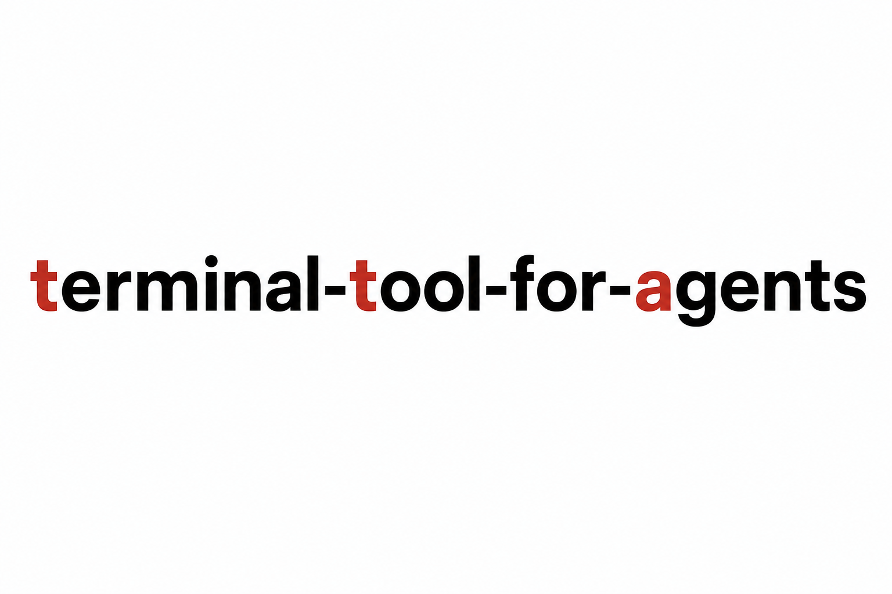

<div align="center">




### **tta: a terminal tool for agents, used by agents to operate interactive terminals.**

[](https://www.npmjs.com/package/terminal-tool-for-agents)

</div>

Install the npm package `terminal-tool-for-agents`, then let your agent use the command `tta`.

## What it is

`tta` is for agents. It lets an agent drive interactive programs through a real PTY: coding agent CLIs, TUIs like `lazygit`, setup wizards like `npm create vite`, and long-running processes you want to observe.

Idea: start background terminals as `sess`, send keys or text as `act`, then wait for completion and read results as `obs`.

Use normal shell tools for plain, non-interactive commands. Use `tta` when the program expects keystrokes, redraws a terminal UI, or needs screen observation between steps.

Forked from [tui-use](https://github.com/onesuper/tui-use) and modified for `tta`. Thanks to [onesuper](https://github.com/onesuper) for the original work.

## Quick Start

Copy this block into your agent:

```text
Install tta CLI:
npm install -g terminal-tool-for-agents

Install the tta skill from:
https://raw.githubusercontent.com/yanggggjie/terminal-tool-for-agents/main/skills/tta/SKILL.md

Confirm both are installed.
```

Then ask your agent to use it:

```text
Use tta to run an interactive coding agent CLI and finish the task.
```

To watch sessions as a human, run:

```bash
tta sess watch
```

Then open http://127.0.0.1:7654/.

## Update

Copy this block into your agent:

```text
Update tta CLI:
npm update -g terminal-tool-for-agents

Update the tta skill from:
https://raw.githubusercontent.com/yanggggjie/terminal-tool-for-agents/main/skills/tta/SKILL.md

Kill all tta sessions so the background service restarts on next use:
tta sess killall

Confirm both are updated.
```

## When to use tta vs shell

| Situation | Tool | Kill session? |
|-----------|------|---------------|
| Plain / non-interactive command | shell | - |
| Interactive CLI one-shot (`npm create vite@latest`) | tta | **Yes** when done |
| Interactive TUI (`lazygit`) | tta | **Yes** when done |
| Interactive agent (chat context) | tta | **No** until task done |
| Long-running + logs (`npm run dev`) | tta | **No** while observing |

Kill one-shot sessions promptly when done. Keep agent and dev-server sessions while their context or logs are still useful. Exited processes are removed from `sess list` automatically.

## Coding agent CLIs

`tta` supports any interactive coding agent CLI. Start the same command you would run in a terminal:

```bash
tta sess start --sess=claude --cmd="claude"
tta sess start --sess=opencode --cmd="opencode"
tta sess start --sess=cursor --cmd="cursor agent"
```

Busy TUIs may keep a footer or spinner moving. `tta obs screen stable` waits until the PTY screen stops changing.

## Examples

```bash
# Dev server: keep session, observe with obs
tta sess start --sess=dev --cmd="npm run dev"
tta obs screen stable --sess=dev

# One-shot interactive CLI: kill when done
tta sess start --sess=vite-once --cmd="npm create vite@latest"
tta obs screen stable --sess=vite-once
tta act send key --sess=vite-once --key=enter
tta obs screen stable --sess=vite-once
tta sess kill --sess=vite-once

# Sub-agent: keep session between turns (prefer --file for prompts)
tta sess start --sess=sub-agent --cmd="claude"
tta obs screen stable --sess=sub-agent
tmp="/tmp/tta-prompt.txt"
cat > "$tmp" <<'EOF'
fix the login bug, run tests, and summarize the changes
EOF
tta act send text --sess=sub-agent --file="$tmp"
tta act send key --sess=sub-agent --key=enter
tta obs screen stable --sess=sub-agent
```


## APIs

All work happens inside a `tta` session. Lifecycle, input, and observation are separate APIs.

| API | Commands | Role | stdout on success |
|-----|----------|------|-------------------|
| **sess** | `start`, `kill`, `killall`, `list`, `keys`, `watch` | Create, stop, list sessions; human watch UI | `success` (list: session names; keys: key names) |
| **act** | `send text`, `send key` | Send input to a running session | `success` |
| **obs** | `screen now`, `screen stable`, `screen scroll` | Read screen from a running session | screen text |

On failure, commands print one line: `error: <reason>` and exit with code 1.

**Workflow:**

```text
tta sess start -> (tta act ... -> tta obs screen stable)* -> tta sess kill
```

- `act` and `obs` both require `--sess=` and assume the session already exists.
- **Agents should prefer `tta act send text --file=`** — write prompt text to a temp `.txt` file (absolute path), then send it. Use `--text=` only for very short input (e.g. a few words with no special characters).
- After every `act` that may change the screen, run `tta obs screen stable --sess=...`.
- Agents use `obs`. Humans use `tta sess watch`.
Human view: `tta sess watch` -> http://127.0.0.1:7654

## Parameters

All options use `--name=value`.

| Flag | Used by |
|------|---------|
| `--sess=` | sess start/kill, act, obs |
| `--cmd=` | sess start |
| `--cwd=` | sess start |
| `--file=` | act send text (preferred) |
| `--text=` | act send text (very short input only) |
| `--key=` | act send key |
| `--dire=` | obs screen scroll |

## Commands

```bash
# sess: session lifecycle
tta sess start  --sess=<name> --cmd=<command> [--cwd=<path>]
tta sess kill   --sess=<name>
tta sess killall
tta sess list
tta sess keys
tta sess watch   # human-only

# act: input (session must exist)
tta act send text --sess=<name> --file=<absolute-path-to-text-file>   # preferred
tta act send text --sess=<name> --text=<text>                         # very short only
tta act send key  --sess=<name> --key=<key>

# obs: read screen (session must exist)
tta obs screen now    --sess=<name>
tta obs screen stable --sess=<name>
tta obs screen scroll --sess=<name> --dire=up|down|top|bottom
```

Agent skill: [`skills/tta/SKILL.md`](skills/tta/SKILL.md)

## Requirements

- **Node.js** 22.x-26.x (`engines`: `>=22.0.0 <27.0.0`); repo includes `.nvmrc` (`24`) for local dev
- After `npm install` or `npm install -g`, if npm warns about allow-scripts for `node-pty`, run `npm approve-scripts node-pty` or `npm approve-scripts --allow-scripts-pending`, then reinstall so PTY prebuilds can install.

## Development

```bash
nvm use          # reads .nvmrc (24)
npm install
npm approve-scripts node-pty   # if npm warns about allow-scripts; then npm install again
just test        # build + verify publish layout
just link        # npm install, build, npm link
```

Local dev (two terminals):

```bash
just dev              # terminal 1: tsc --watch + nodemon server
tta sess watch        # terminal 2: open http://127.0.0.1:7654
```

- **Backend** (`src/*.ts`): save → tsc recompiles → nodemon restarts server → refresh browser.
- **Watch UI** (`src/watch-ui/*`): save → refresh browser (served directly from `src/` in dev).
- While `just dev` is running, `tta` will not auto-spawn a detached server; start `just dev` first.

## License

MIT
