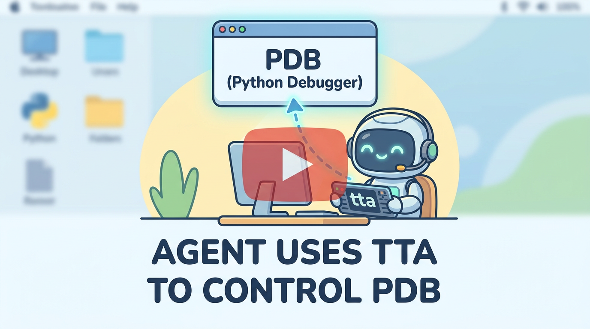
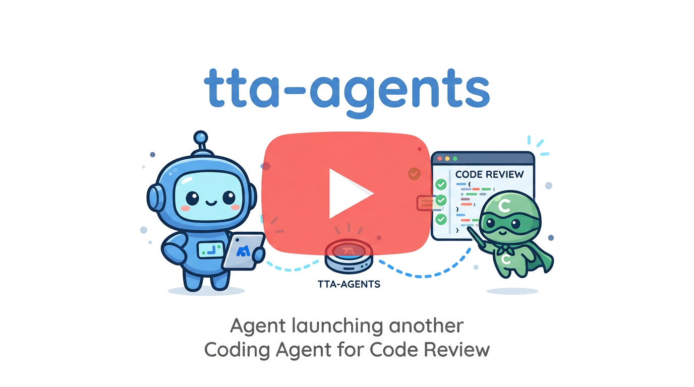
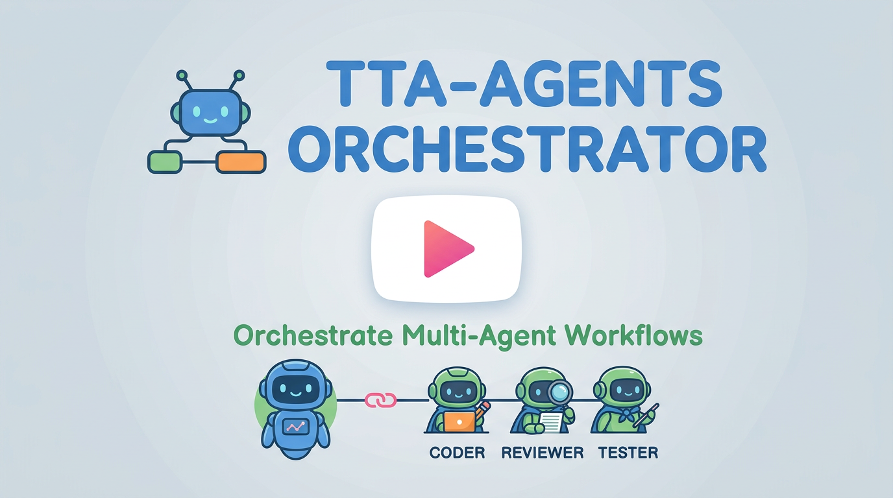

<div align="center">


### **tta: lets agents operate interactive terminals**

[](https://www.npmjs.com/package/terminal-tool-for-agents)

[中文 README](./README.zh.md)

</div>


## What it is

`tta` lets agents drive interactive terminal programs: REPLs (e.g. `GDB`, `IPython`), TUIs (e.g. `lazygit`), setup wizards (e.g. `npm create vite`), dev servers (e.g. `npm run dev`), and **coding agent CLIs** (e.g. Claude Code, see [tta-agents](./docs/tta-agents-docs.md)).

Forked from [tui-use](https://github.com/onesuper/tui-use) and modified for `tta`. Thanks to [onesuper](https://github.com/onesuper) for the original work.

## Choose a mode

| Mode | Best for | Docs |
|------|----------|------|
| `tta` | Let the current agent operate one interactive terminal program | This README |
| `tta-agents` | Temporarily start another coding agent for one task, such as review | [tta-agents](./docs/tta-agents-docs.md) |
| `tta-agents-orchestrator` | Use multiple coding agents as a long-horizon coder / reviewer / tester workflow | [tta-agents-orchestrator](./docs/tta-agents-orchestrator.md) |

`tta` is not tied to one agent. Coding agents such as Codex and OpenCode can use it; assistant agents such as OpenClaw and Hermes can use it too, including flows like OpenClaw driving Claude Code remotely. The only hard requirement is Node.js.

## Examples

### tta

Let an agent operate an interactive terminal.

<a href="https://youtu.be/dcl5HimC-dA?si=uqlNkuK2jX0-kwJ8" target="_blank" rel="noopener noreferrer">
  
</a>

[IPython example](https://youtu.be/9QbJjwJP39M?si=SPvCswWN130JV8g1)

### tta-agents

Let an agent start another coding agent for a task.

<a href="https://youtu.be/rjKqwjowtJc?si=E6Ne2YlplVcoP3Hg" target="_blank" rel="noopener noreferrer">
  
</a>

### tta-agents-orchestrator

Let multiple coding agents collaborate through `Orchestrator.md`.

<a href="https://youtu.be/rbCijIwmk0Y?si=ax7aFl6SSHW1UWz0" target="_blank" rel="noopener noreferrer">
  
</a>

[Orchestrator.md used in the video](https://github.com/yanggggjie/rising-repo/blob/main/Orchestrator.md)

[Why tta-agents?](./docs/why-tta-agents.md)

## Quick Start

**Copy this into your agent to install:**

```text
Install tta CLI:
npm install -g terminal-tool-for-agents

Install tta skills from GitHub:
Use this directory listing:
https://api.github.com/repos/yanggggjie/terminal-tool-for-agents/contents/skills/tta?ref=main

Install every top-level .md skill file in that directory.
Do not install anything under skills/tta/zh/.
Do not hard-code the file list; discover it from the directory listing.

Confirm CLI and all discovered top-level skill files are installed.
```

**Ask your agent to use tta:**

```text
Use tta to run an interactive terminal program and finish the task.
```

**Observe sessions:**

```bash
tta sess watch
```

Then open http://127.0.0.1:7654/.

## Update

Copy this block into your agent:

```text
Update tta CLI:
npm update -g terminal-tool-for-agents

Update tta skills from GitHub:
Use this directory listing:
https://api.github.com/repos/yanggggjie/terminal-tool-for-agents/contents/skills/tta?ref=main

Update every top-level .md skill file in that directory.
Do not install anything under skills/tta/zh/.
Do not hard-code the file list; discover it from the directory listing.

Confirm CLI and all discovered top-level skill files are updated.
```

## API overview

All tta work happens inside a **session** (`--sess=`):

| API | Commands | Role |
|-----|----------|------|
| **sess** | `start`, `kill`, `killall`, `list`, `keys`, `watch` | Create, stop, list sessions; human watch UI |
| **act** | `send text`, `send key` | Send input to a **running** session |
| **obs** | `screen now`, `screen stable`, `screen scroll` | Read session screen |

```text
tta sess start -> (tta act ... -> tta obs screen stable)* -> tta sess kill
```

On failure, tta prints one line: `error: <reason>` and exits with code 1.

Full command templates and error handling: [`skills/tta/SKILL.md`](./skills/tta/SKILL.md).

## Requirements

- **Node.js** 22.x–26.x (`engines`: `>=22.0.0 <27.0.0`); repo includes `.nvmrc` (`24`) for local dev
- Install runs `postinstall` automatically: copies node-pty prebuilds into `build/Release` and verifies the PTY works; no manual `approve-scripts` needed

## Development

For local development:

```bash
just install-dev-version
```

Builds, installs the current repo globally; `postinstall` runs `tta sess killall` to stop the old server.

```bash
tta sess list    # verify CLI
tta sess watch   # http://127.0.0.1:7654
```

Restore the published npm release:

```bash
just install-npm-version
```

## License

MIT
